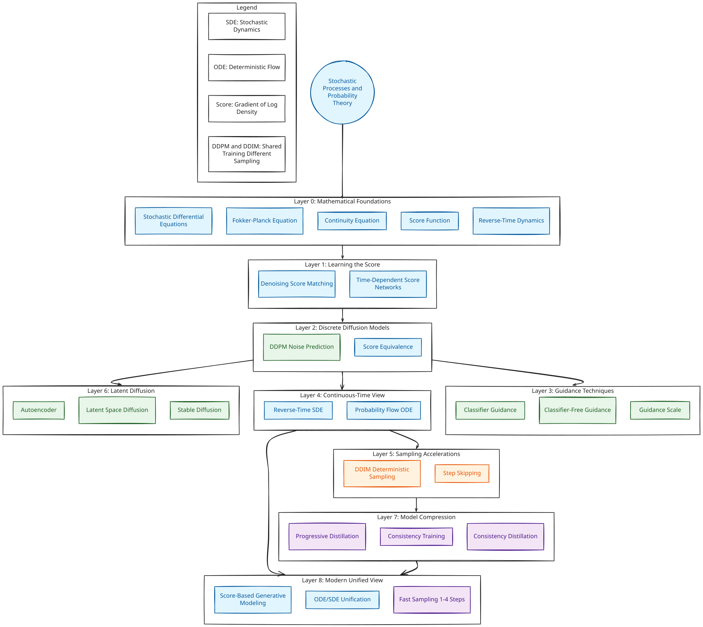

# Diffusion Model Paper Replications

This project aims to replicate key papers in the field of Diffusion Models. It serves as a study guide and code repository for understanding the implementations of these generative models.

## How Diffusion Branches & Expands



Diffusion models work by learning to reverse a gradual noising process. Starting from pure noise, they iteratively denoise to generate samples. The diagram above shows how diffusion branches out from a single point (noise) and expands through the reverse process to create complex data distributions.

## LoRA Finetuning on Anime Dataset

We fine-tuned **SDXL** (`stabilityai/stable-diffusion-xl-base-1.0`) on a custom anime dataset using LoRA to adapt the model's generation toward a specific anime art style. Below are example outputs from the fine-tuned model:


### Pipeline

**Step 1 — Image Captioning**

We used `google/gemma-4-26B-A4B-it` served via vLLM on an A100 GPU (`scripts/caption.py`) to generate detailed SDXL-friendly captions for each anime image. Each caption describes character appearance, expression, setting, lighting, and art style.

```bash
python3 -m vllm.entrypoints.openai.api_server \
    --model google/gemma-4-26B-A4B-it \
    --dtype bfloat16 \
    --max-model-len 4096 \
    --max-num-batched-tokens 4096 \
    --gpu-memory-utilization 0.90 \
    --trust-remote-code \
    --port 8000
```

Captions are saved as `{id}.txt` alongside images in `finetune_data/`.

**Step 2 — LoRA Training**

On a cloud pod we cloned the repo, installed dependencies, and launched training with `scripts/train_lora_sdxl.py`. The LoRA adapter is pushed to HuggingFace Hub upon completion.

```bash
export PATH="$HOME/.local/bin:$PATH"

git clone https://github.com/TM23-sanji/stable_diffusion.git
cd stable_diffusion

pip install --user \
    "diffusers>=0.27.0" \
    "transformers>=4.40.0" \
    "accelerate>=0.29.0" \
    "peft>=0.10.0" \
    "safetensors>=0.4.0" \
    "huggingface_hub>=0.22.0" \
    "wandb>=0.17.0" \
    "Pillow>=10.0.0" \
    "tqdm" \
    "xformers" \
    "bitsandbytes>=0.43.0"

accelerate config default --mixed_precision bf16

accelerate launch \
    --num_processes 1 \
    --mixed_precision bf16 \
    --dynamo_backend no \
    scripts/train_lora_sdxl.py
```

Checkpoints are saved on the pod; the final LoRA is uploaded to HuggingFace Hub at `YOUR_HF_USERNAME/anime-sdxl-lora`.

**Step 3 — Inference**

Use `scripts/test_lora.py` to generate images from 100 varied prompts. The LoRA weights are loaded from the Hub and images are saved to `generated_100/`.

```bash
python scripts/test_lora.py
zip -r images.zip generated_100/
scp -i ~/.ssh/private_key.pem ubuntu@154.54.100.100:/home/ubuntu/stable_diffusion/images.zip ~/Downloads/
```

## Recommended Reading

*   **[What are Diffusion Models?](https://lilianweng.github.io/posts/2021-07-11-diffusion-models/)** by Lilian Weng - An excellent comprehensive blog post explaining the mathematics and theory behind diffusion models.
*   **[Peter Holderrieth's Blog](https://www.peterholderrieth.com/blog)** - Great resource covering Langevin dynamics, stochastic differential equations, and diffusion models. 

These resources are time consuming to read but are very helpful for understanding the math behind the models.

## Famous Papers

Here is a list of foundational papers that we aim to explore and replicate:

*   **Deep Unsupervised Learning using Nonequilibrium Thermodynamics** (2015)
    *   *Authors:* Jascha Sohl-Dickstein et al.
    *   [Link regarding the paper](https://arxiv.org/abs/1503.03585)

*   **Denoising Diffusion Probabilistic Models (DDPM)** (2020)
    *   *Authors:* Jonathan Ho, Ajay Jain, Pieter Abbeel
    *   [arXiv Link](https://arxiv.org/abs/2006.11239)

*   **Denoising Diffusion Implicit Models (DDIM)** (2020)
    *   *Authors:* Jiaming Song, Chenlin Meng, Stefano Ermon
    *   [arXiv Link](https://arxiv.org/abs/2010.02502)

*   **Diffusion Models Beat GANs on Image Synthesis** (2021)
    *   *Authors:* Prafulla Dhariwal, Alex Nichol
    *   [arXiv Link](https://arxiv.org/abs/2105.05233)

*   **High-Resolution Image Synthesis with Latent Diffusion Models** (2021)
    *   *Authors:* Robin Rombach et al.
    *   [arXiv Link](https://arxiv.org/abs/2112.10752)

*   **Classifier-Free Diffusion Guidance** (2022)
    *   *Authors:* Jonathan Ho et al.
    *   [arXiv Link](https://arxiv.org/abs/2207.12598)
